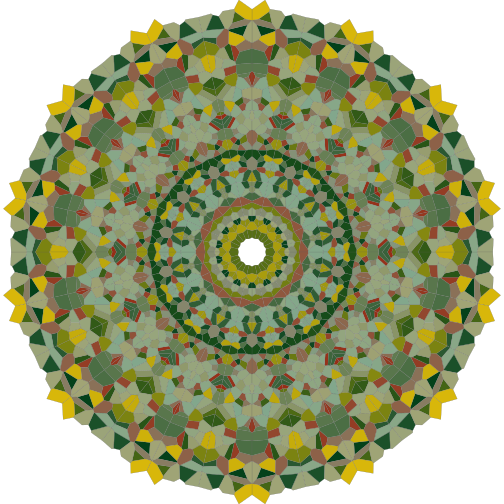

# meditate

[](https://travis-ci.org/jfisher-usgs/meditate)
[](https://CRAN.R-project.org/package=meditate)
[](https://CRAN.R-project.org/package=meditate)
[](https://CRAN.R-project.org/package=meditate)

## Overview

The [R](https://www.r-project.org/) package **meditate** is a simple meditation timer that logs session information.

## Install

The current release is available on [CRAN](https://CRAN.R-project.org/package=meditate "The Comprehensive R Archive Network"), which you can install using the following command:

```r
install.packages("meditate")
```

To install the development version, you need to clone the repository and build from source, or run:

```r
remotes::install_github("jfisher-usgs/meditate")
```

## Usage

Begin a 10-minute meditation session:

```r
meditate::Meditate(10)
```
Access help documentation:

```r
help("Meditate", package = "meditate")
```

## Contact

Please consider reporting bugs and asking questions on the [Issues page](https://github.com/jfisher-usgs/meditate/issues).

## License

This package is free and open source software, licensed under GPL (>= 2).


